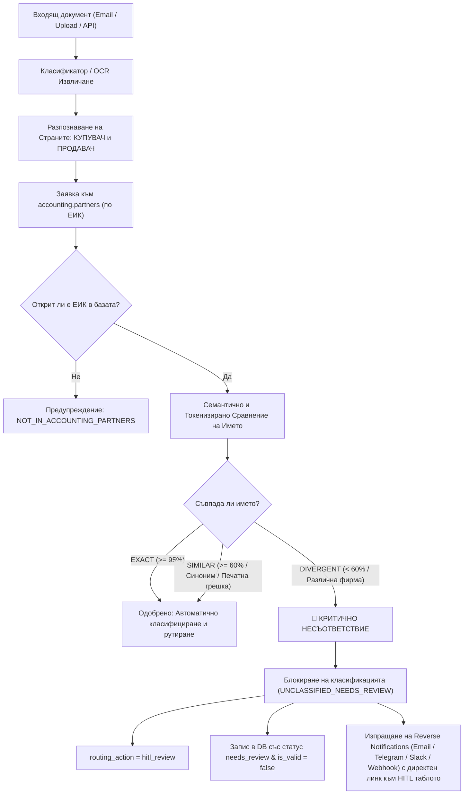

# Верификация на Контрагенти и HITL Контрол при Разминаване на Данни

## 1. Резюме на Решението

В изпълнение на изискването за автоматично сравняване на **ЕИК** и **наименованията на страните** (КУПУВАЧ и ПРОДАВАЧ) при постъпване на документ през:
- Имейл адреси: `docs@incontrolplus.com` и `invoice@incontrolplus.com`
- REST OCR контейнера: `ocr.openbalancer.com` (`/api/v1/classify/document` и `/api/v1/invoices/process`)

Беше разработен и внедрен цялостен защитен механизъм ([`invoice_core/partner_verification.py`](file:///Users/diokarabaz/orca/projects/invoice-tessearct-ocr/invoice_core/partner_verification.py)), който:
1. Извлича разпознатите **ЕИК** и **имена** на двамата контрагенти в документа.
2. Проверява наличността на двата ЕИК номера в новата централна база данни `accounting.partners` в Supabase PostgreSQL.
3. Сравнява разпознатото текстово име на фирмата спрямо официалното фирмено наименование (`legal_name`), транслитерация (`transliteration`), търговска марка (`trade_name`) и познати псевдоними (`ocr_aliases`).
4. При **тотално разминаване** между името във фактурата и официалното име на фирмата, притежаваща този ЕИК в регистъра:
   - Документът **НЕ се класифицира като валидна фактура** и **НЕ се насочва за автоматично осчетоводяване**.
   - Маркира се със статус `status: "needs_review"` и действие `routing_action: "hitl_review"`.
   - Генерира се детайлно обяснение на български език за несъответствието в `hitl_reasons`.
   - Обратните известия по имейл, Telegram и Slack предупреждават с висок приоритет за необходимост от ръчен одит.

---

## 2. Архитектура на Сравнението



---

## 3. Специфика на Алгоритъма за Сходство

| Казус | Разпознато във Фактурата | Официално в `accounting.partners` | Резултат | Действие |
|---|---|---|---|---|
| **Точно съответствие** | `МЕТРО БЪЛГАРИЯ ЕООД` | `МЕТРО БЪЛГАРИЯ ЕООД` | `EXACT (100%)` | Автоматично одобрение |
| **Търговски синоним** | `Gentleman Barbershop` | `ДЖЕНТЪЛМЕН ГРУП ЕООД` (alias: `Gentleman`) | `EXACT (100%)` | Автоматично одобрение |
| **Транслитерация** | `Gentleman Group OOD` | `ДЖЕНТЪЛМЕН ГРУП ЕООД` | `EXACT (100%)` | Автоматично одобрение |
| **OCR печатна грешка** | `Дженталмен Груп` | `ДЖЕНТЪЛМЕН ГРУП ЕООД` | `SIMILAR (>80%)` | Автоматично нормализиране |
| **Критично разминаване** | `ТОПЛИВО АД` | `ДЖЕНТЪЛМЕН ГРУП ЕООД` (ЕИК 203818240) | `DIVERGENT (0%)` | **Блокиране -> HITL Review** |
| **Стоп-думи капан** | `Шел България ЕАД` | `Кауфланд България ЕООД` | `DIVERGENT (0%)` | **Блокиране -> HITL Review** |

> [!NOTE]
> Защитен механизъм срещу фалшиви съвпадения: Думи от типа *„България"*, *„Група"*, *„Инвест"*, *„София"* са изолирани като стоп-думи (`GENERIC_STOP_WORDS`) и не могат да бъдат единствена основа за съвпадение между две напълно различни компании.

---

## 4. Резултати от Тестване на Живо на `ocr.openbalancer.com`

### 4.1. Тест с Реална Валидна Фактура (`2205461930.pdf` - Метро България)
```json
{
  "status": "success",
  "category": "Фактури",
  "routing_action": "routed_to_invoices",
  "requires_hitl": false,
  "parties_verification": {
    "supplier": {
      "role": "supplier",
      "eik": "121644736",
      "recognized_name": "МЕТРО БЪЛГАРИЯ ЕООД",
      "db_partner_found": true,
      "db_canonical_name": "МЕТРО БЪЛГАРИЯ ЕООД",
      "match_status": "EXACT",
      "similarity_score": 1.0,
      "is_critical_mismatch": false
    },
    "recipient": {
      "role": "recipient",
      "eik": "208139865",
      "recognized_name": "Сикрет Леджънд ЕООД",
      "db_partner_found": true,
      "db_canonical_name": "СИКРЕТ ЛЕДЖЪНД ЕООД",
      "match_status": "EXACT",
      "similarity_score": 1.0,
      "is_critical_mismatch": false
    },
    "both_eiks_in_db": true,
    "has_critical_mismatch": false
  }
}
```

### 4.2. Тест с Документ с Критично Разминаване (ЕИК на Джентълмен, но име Топливо АД)
```json
{
  "status": "needs_review",
  "category": "Некласифицирани",
  "category_code": "UNCLASSIFIED_NEEDS_REVIEW",
  "routing_action": "hitl_review",
  "requires_hitl": true,
  "hitl_reasons": [
    "Критично разминаване за продавач: разпознатото в документа име 'ТОПЛИВО АД' е напълно различно от официалното име на фирмата по ЕИК 203818240 в accounting.partners ('ДЖЕНТЪЛМЕН ГРУП ЕООД')."
  ],
  "parties_verification": {
    "supplier": {
      "role": "supplier",
      "eik": "203818240",
      "recognized_name": "ТОПЛИВО АД",
      "db_partner_found": true,
      "db_canonical_name": "ДЖЕНТЪЛМЕН ГРУП ЕООД",
      "match_status": "DIVERGENT",
      "similarity_score": 0.0,
      "is_critical_mismatch": true
    },
    "both_eiks_in_db": true,
    "has_critical_mismatch": true,
    "requires_hitl": true
  }
}
```

---

## 5. Статус на Контейнера на Сървъра

- Контейнерът `invoice-ocr-api` на `macmini-primary` е прекомпилиран и пуснат успешно.
- Всички тестове на microservice-a преминават (`50 passed`).
- Трафикът през Cloudflare (`https://ocr.openbalancer.com`) обработва коректно всички входящи заявки.
